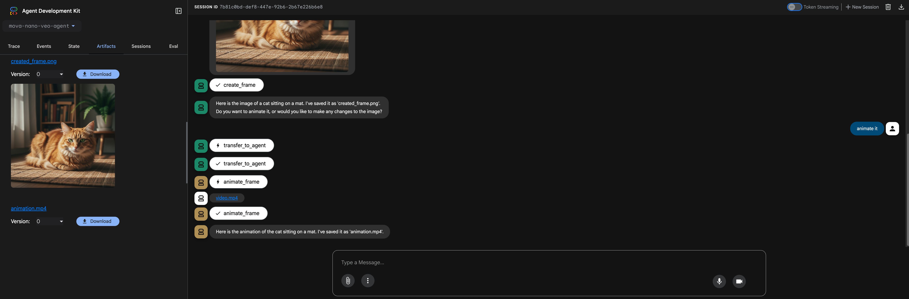

# Mova Nano Veo Agent

**Python Version:** 3.12
**Author:** Your Name

An AI agent that creates animated videos from text prompts in a simple, two-step process.

## How It Works

Mova is an AI assistant that orchestrates two specialized agents to bring your ideas to life:
## How It Works


1.  **Nano Agent:** This agent creates a still image frame based on your description.
2.  **Veo Agent:** This agent takes the generated frame and animates it according to your instructions.




The workflow is simple: you provide a prompt to create a scene, and then a second prompt to animate it.

## Demo

### Example

**User:** "Create a frame of a futuristic car flying through a neon-lit city at night."

**Mova (using Nano Agent):** "I have created the frame for you. It's saved as `created_frame.png`. Would you like to animate it?"

**User:** "Yes, make the car do a barrel roll."

**Mova (using Veo Agent):** "I'm animating the frame now. Your video `animation.mp4` will be ready shortly."

## Capabilities

*   **Text-to-Image Generation:** Create unique still frames for your animations.
*   **Image-to-Video Animation:** Animate the generated frames to create short video clips.

## Getting Started

1.  **Clone the repository:**
    ```bash
    git clone https://github.com/giulio-salierno/mova-nano-veo-agent.git
    cd mova-nano-veo-agent
    ```

2.  **Set up your environment:**

    This project uses Google Cloud services for image and video generation. Make sure you have the `gcloud` CLI installed and authenticated:
    ```bash
    gcloud auth application-default login
    ```

3.  **Install dependencies:**
    ```bash
    make install
    ```

## Running the Agent with ADK

The Agent Development Kit (ADK) provides two ways to run the agent:

### 1. In the terminal:

Use the `adk run` command to execute the agent directly in your terminal.

```bash
adk run
```

### 2. With a web interface:

For an interactive chat application interface, use `adk web`.

```bash
adk web
```

This will start a local web server, and you can interact with the agent in your browser.
