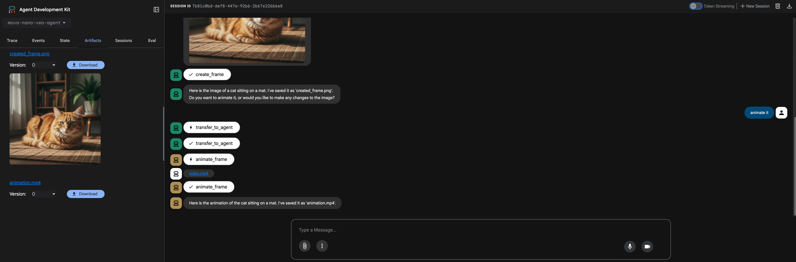

# Mova Nano Veo Agent

**Python Version:** 3.12
**Author:** Giulio Salierno, Lorenzo Spataro

An AI agent that creates and animates images from text prompts using Gemini and Veo.

## How It Works

Mova is a single AI agent that guides users through a two-step creative process:

1. **Create a Frame:** Generates an image using `gemini-2.5-flash-image` based on your description. Supports editing previously generated images.
2. **Animate the Frame:** Animates the generated image into an 8-second video using `veo-3.1-fast-generate-preview`.



Images and videos are persisted via GCS (keyed by user ID) so they survive across requests, including on Agent Engine's Gemini Enterprise playground which resets session state on every request.

## Demo

### Example

**User:** "Create a frame of a futuristic car flying through a neon-lit city at night."

**Mova:** "I have created the frame for you. Would you like to animate it?"

**User:** "Yes, make the car do a barrel roll."

**Mova:** "I'm animating the frame now. Your video will be ready shortly."

## Capabilities

- **Text-to-Image Generation:** Create images with `create_frame`
- **Image Editing:** Modify previously generated images by setting `is_image_edit=True`
- **Image-to-Video Animation:** Animate generated frames into video with `animate_frame`
- **GCS Persistence:** Images and videos stored in GCS, surviving session resets

## Getting Started

1. **Clone the repository:**
    ```bash
    git clone https://github.com/giuliosalierno/mova-nano-veo-agent.git
    cd mova-nano-veo-agent
    ```

2. **Set up your environment:**
    ```bash
    gcloud auth application-default login
    cp .env.example .env
    # Edit .env with your project ID and bucket name
    ```

3. **Install dependencies:**
    ```bash
    make install
    ```

4. **Create the GCS bucket:**
    ```bash
    gcloud storage buckets create gs://YOUR_PROJECT_ID-mova-artifacts --location=us-central1
    ```

## Running the Agent

### Local playground (ADK Web):

```bash
make playground
```

### Deploy to Agent Engine:

```bash
make deploy
```
